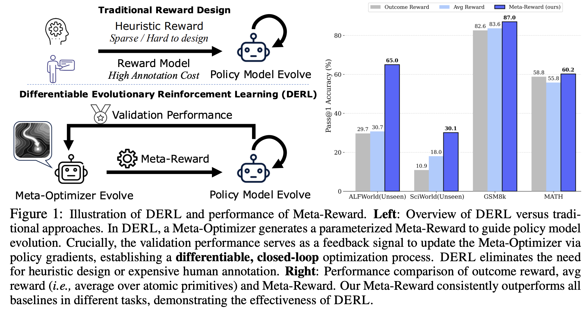
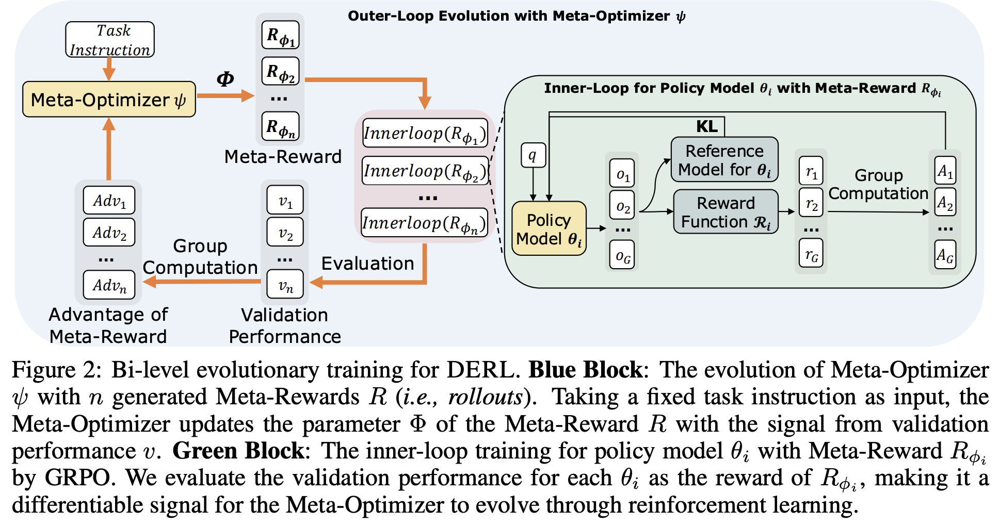

# DERL


<div align="center">

<h1>Differentiable Evolutionary Reinforcement Learning</h1>

<a href="https://arxiv.org/abs/2512.13399">
  
</a><a href="https://huggingface.co/DifferentiableEvolutionaryRL">
  
</a><a href="https://github.com/sitaocheng/DERL">
  
</a>

</div>

<hr>

This repository contains the code accompanying the paper **Differentiable Evolutionary Reinforcement Learning**. The repo is built upon [veRL](https://github.com/volcengine/verl). We adopt GRPO for inner-loop and outer-loop evolution. The training loop is implemented by ourself, the group relative advantage calculation for outer-loop and the inner-loop training are adapted from VeRL original code.


## Contents

<p align="center">
<a href="#overview">[Overview]</a>
<a href="#quick-start">[Quick Start]</a>
<a href="#file-descriptions">[File Discriptions]</a>
<a href="#citation">[Citation]</a>
</p>


## Overview

Here is the main idea and results of DERL.


Our bi-level evolutionary training is illustrated as follows.


## Quick Start

1. Clone the repository:
   ```bash
   git clone https://github.com/sitaocheng/DERL
   cd DERL
   ```

2. Install dependencies via `pip`:
   ```bash
   pip install -r requirements.txt
   ```

3. Modify the path and settings in grpo_coordinator.py and run_qwen2_5_3b_llm_math_meta_llm_rl.sh based on your environments.

4. Download the base model as inner-loop policy model (e.g., Qwen/Qwen-2.5-3B) and modify the model_path in the script accordingly. 

5. Download our provided initialized outer-loop Meta-Optimizer from our [huggingface_repo](https://huggingface.co/DifferentiableEvolutionaryRL) modify INITIAL_MODEL_PATH in grpo_coordinator.py accordingly.

6. Download and prepare your training and testing data into `./dataset/`. Modify the data path in eval_llm.py. We recommend using scripts in `./examples/data_preprocess` or based on your own environments and tasks.

7. Customize your own atomic primitives in `./verl/utils/reward_score/meta_reward_grpo.py` and modify the dataset info in `./verl/utils/reward_score/__init__.py`.

6. Run python grpo_coordinator.py.
   ```bash
   python grpo_coordinator.py
   ```

## File Descriptions

- `grpo_coordinator.py`, `grpo_coordinator_population.py`: The main code coordinating the outer-loop and inner-loop training for DERL and DERL-pop., respectively.
- `eval_llm.py`: The code for evaluating validation performance and testing performance.
- `constrained_rollout.py`: The code for generating Meta-Reward with constrained decoding.
- `expression_check.py`: The code to check the format of Meta-Reward as a valid mathematical composition.
- `./verl/utils/reward_score/meta_reward_grpo.py`: The code to modify the atomic primitives.
- `./verl/utils/reward_score/__init__.py` contains the code to adopt Meta-Reward (custom_fn).
- `./verl/trainer/ppo/ray_trainer.py` contains the code for outer-loop grpo evolution (fit_outer()).
- `./examples/grpo_trainer/run_qwen2_5_3b_llm_math_meta_llm_rl.sh`: script for inner-loop evolution.
- `./examples/grpo_trainer/run_qwen2_5_3b_llm_math_meta_llm_rl_population.sh`: script for DERL-pop. inner-loop evolution.
- `./examples/grpo_trainer/run_qwen2_5_05b_instr_math_meta_rl.sh`: script for outer-loop evolution.


## Citation

If you find this repository useful, please cite our paper:

```bibtex
@misc{cheng2025differentiableevolutionaryreinforcementlearning,
      title={Differentiable Evolutionary Reinforcement Learning}, 
      author={Sitao Cheng and Tianle Li and Xuhan Huang and Xunjian Yin and Difan Zou},
      year={2025},
      eprint={2512.13399},
      archivePrefix={arXiv},
      primaryClass={cs.AI},
      url={https://arxiv.org/abs/2512.13399}, 
}
``` 
